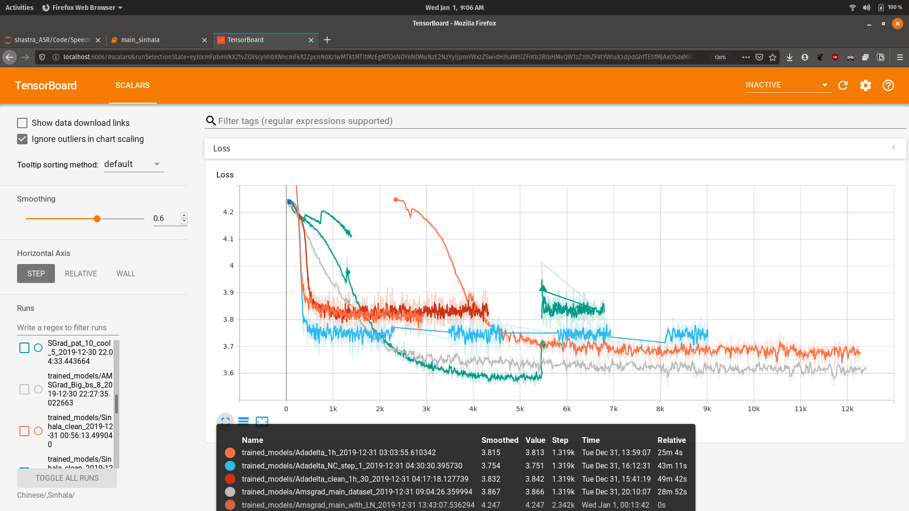

# Multilingual Speech Recognition and Machine Translation

This project began as a part of finals of Defense Innovation Challenge, Shaastra 2020, IIT Madras. 

Click here to see the **[Problem statement](https://github.com/sachin-101/Multilingual-ASR-and-MT/blob/master/papers/problem_statement.pdf)**

The competition is over and I have taken it as a **personal project** now. **All the Neural Network architectures in this project are written from scratch** using Numpy and **PyTorch**.

## Current Status

### Approach :
The given problem statement of translating the incoming input signal and giving output can be broken down into two subtasks:
1. **Speech Recognition** – This system takes in the input audio and outputs it in text format in the same language in which it was spoken. 
2. **Machine Translation** – This system takes the output text of speech recognition model and translates into the required output language.

### Benefits of dividing into subtasks

- I am using data driven Deep Learning methods to realize these systems. And I can find datasets which are speech to text and text to text online. 

### ASR system
- Deep Learning based Speech Recognition model. I have implemented an Attention based Encoder-Decoder network for the ASR system.
- It is based on the paper Listen, Attend and Spell.
- The audio input is converted to a MelSpectrogram which is fed to the model.
- It is a character-based model and thus decoder outputs character sequences.

<figure align="center">
  
  <figcaption>Spectrogram extracted from input audio and corresponding attention map</figcaption>
</figure>

### Machine Translation system

- The model is based on Encoder-Decoder architecture with Attention.
- It gets the input from the ASR and it translates it to the selected output language.
- Before feeding to the model, the sentences are pre-processed, tokenized and normalized.
- The attention mechanism, here helps to translate longer sentences.

<figure align="center">
  
  <figcaption>Some Trianing Logs</figcaption>
</figure>

## Progress

- [x] Implement CTC model
- [x] Implement attention based Encoder-Decoder model
- [x] Add Language model
- [ ] Add SpecAugment on input Spectrograms
- [ ] Add Beam Search
- [ ] Implement joint Attention-CTC model
- [ ] Implement words, sub-words model

## Acknowledgements

- Thanks, [Yash Patel](https://github.com/ComputerMaestro) for guiding me during this project. 
- Alexander's [End-to-end-ASR-Pytorch](https://github.com/Alexander-H-Liu/End-to-end-ASR-Pytorch) has been a great help for me while developing this project.

## Reference

1. [Listen, Attend and Spell](https://arxiv.org/abs/1508.01211v2), W Chan *et al.*
2. [SpecAugemnt: A Simple Data Augmentation Method for Speech Recognition](https://arxiv.org/abs/1904.08779), Park *et al*.
3. [Connectionist Temporal Classification: Labelling Unsegmented Sequence Data with Recurrent Neural Networks](https://www.cs.toronto.edu/~graves/icml_2006.pdf), A Graves *et al*.
4. [Joint CTC-Attention based End-to-End Speech Recognition using Multi-task Learning](https://arxiv.org/abs/1609.06773), S Kim *et al.* 
